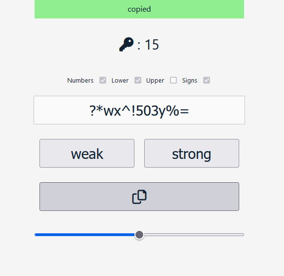

# pwdGen 



[*english*]
pwdGen is a strong password generator, you can choose a size between
between 12 and 18 alphanumeric characters including symbols (letters lowercase and uppercase).

[*italiano*]
pwdGen è un generatore di password complesse, si può scegliere una grandezza compresa
tra i 12 e 18 caratteri alfanumerici comprensivi di simboli (lettere minuscole e maiuscole).

[pwdGen DEMO](https://marcellopagano.github.io/pwdGen/)

### *syntax*:
``` javascript
pwdGen(maxRange)
```

---

### *params*:

``` javascript
    /*
    @param maxRange?: number [* 12]

    * default value
    */
```

